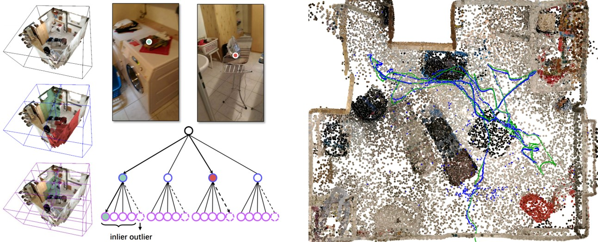

## [CVPR 2021 Oral] [Robust Neural Routing Through Space Partitions for Camera Relocalization in Dynamic Indoor Environments](https://arxiv.org/abs/2012.04746)

*[Siyan Dong](https://siyandong.github.io/), *[Qingnan Fan](https://fqnchina.github.io/), [He Wang](https://ai.stanford.edu/~hewang/), [Ji Shi](http://blog.sjj118.com/), [Li Yi](https://ericyi.github.io/), 
[Thomas Funkhouser](https://www.cs.princeton.edu/~funk/), [Baoquan Chen](http://cfcs.pku.edu.cn/baoquan/), [Leonidas J. Guibas](https://geometry.stanford.edu/member/guibas/)



We provide the implementation of NeuralRouting, a novel outlier-aware neural tree model to estimate camera pose in dynamic environments. 
The model builds on three important blocks: (a) a hierarchical space partition over the indoor scene to construct a decision tree; (b) a neural routing function, implemented as a deep classification network, employed for better 3D scene understanding; and (c) an outlier rejection module used to filter out dynamic points during the hierarchical routing process. After establishing camera-to-world 3D-3D correspondences, a Kabsch based RANSAC is applied to solve the camera pose. 


Overall, our algorithm consists of two steps: a scene coordinate regressor for 3D-3D correspondence establishment and a Kabsch-based RANSAC algorithm for camera pose optimization. The coordinate regressor is scene-specific and is learned in each scene. At inference time, the camera pose is estimated by inferencing coordinate regression and running the RANSAC.


## Citation

If you find our work helpful in your research, please consider citing:
```
@inproceedings{dong2021neuralrouting,
  title={Robust Neural Routing Through Space Partitions for Camera Relocalization in Dynamic Indoor Environments},
  author={Dong, Siyan and Fan, Qingnan and Wang, He and Shi, Ji and Yi, Li and Funkhouser, Thomas and Chen, Baoquan and Guibas, Leonidas},
  booktitle={IEEE Conference on Computer Vision and Pattern Recognition (CVPR)},
  year={2021}
}
```


## Code will be released soon...

